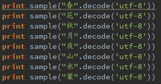
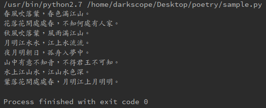

## pytorch char-RNN

训练数据是全唐诗，网上英语的的char-RNN在诗词的效果上很一般，可能是因为中文诗词比较稀疏，加入一个embedding层之后训练会好很多。

没有将数据padding成固定格式，所以可能会比较慢

总的训练样本大概有50k首诗，最后效果还可以。

如果训练样本少于1000，比如我只拿李白的诗，会发现模型基本上将所有诗全记下了，最后生成的除了个别词不一样，都是样本里的东西。

所以感觉以前拿char-RNN训练汪峰歌词的多半是没拟合好，样本对此中文词来说也太稀疏了。

## usage

train.py是训练模型用的，你可以修改dataHandler.py选择不同数据，如宋词

sample.py是生成语句的，修改代码执行：

## pytorch

pytorch还是很好用的，看了Mxnet、Pytorch、Tensorflow三家对于RNN的实现，M和P的框架是不错的，实现比较方便，但M的代码有些乱。T的实现有点醉。

pytorch是以python优先的框架，所以代码看起来很舒服，组织得很好，值得学习。

## 诗词来源

https://github.com/jackeyGao/chinese-poetry

库中缺少cinese-poetry文件夹，直接上面这个库clone即可，里面还有宋词，不过没来得及玩
